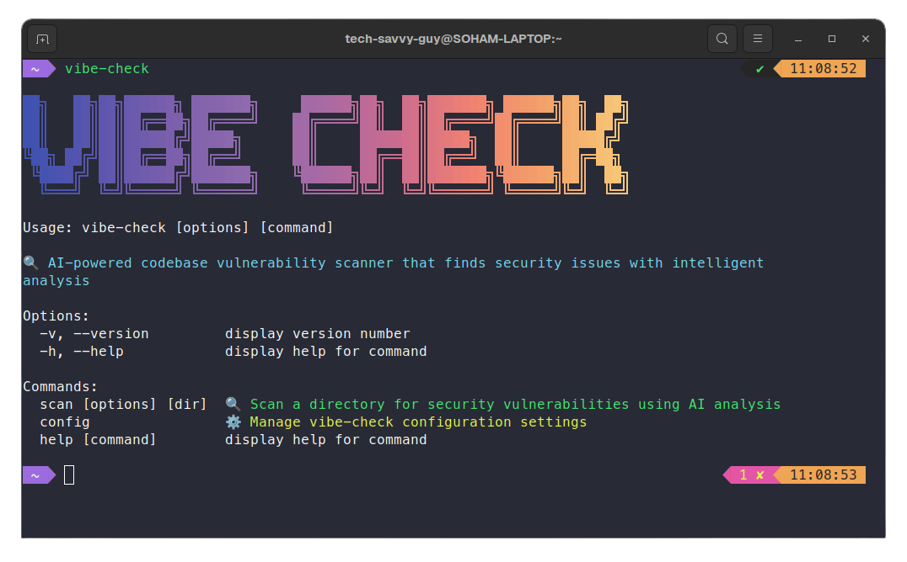

# vibe-check

**AI-powered codebase vulnerability scanner that finds security issues with intelligent analysis**

`vibe-check` is a sophisticated security analysis tool that leverages advanced AI models to perform comprehensive codebase security audits. Unlike traditional static analysis tools that rely on predefined rules, `vibe-check` uses Large Language Models (LLMs) to understand code context and identify complex security vulnerabilities that might be missed by conventional scanners.

<!-- Add a image below -->



## Quick Start

### Installation

```bash
npm install -g vibe-checker
```

### Setup

Configure your OpenRouter API key and select an AI model:

```bash
vibe-check config setup
```

### Scan Your Codebase

```bash
# Scan current directory
vibe-check scan

# Scan specific directory
vibe-check scan /path/to/your/project

# Generate PDF report
vibe-check scan --pdf security-report.pdf

# Save JSON output
vibe-check scan --output report.json
```

## Security Analysis Algorithm

### Core Analysis Engine

`vibe-check` employs a multi-stage AI-powered analysis process that combines contextual understanding with security expertise:

#### 1. **Codebase Context Building**
```
Directory Scanning
├── File Discovery (supports 20+ languages)
├── Smart Filtering (ignores node_modules, .git, etc.)
├── Content Analysis (max 100KB per file)
└── Language Detection (JS/TS, Python, Java, etc.)
```

The `ContextManager` component builds a comprehensive understanding of your codebase:
- **File Scanning**: Recursively scans directories for supported file types
- **Content Extraction**: Reads and processes source code files
- **Language Classification**: Identifies programming languages for targeted analysis

#### 2. **AI-Powered Security Analysis**

The heart of Vibe-Check is its sophisticated AI analysis engine powered by state-of-the-art language models:

```
AI Analysis Pipeline
├── Structured Prompt Engineering
├── Multi-Model Support (DeepSeek R1, Gemini 2.0, Qwen 2.5, etc.)
├── Vulnerability Schema Validation
└── Context-Aware Security Assessment
```

**Analysis Categories:**
- **Authentication & Authorization**: Weak auth mechanisms, missing access controls, privilege escalation
- **Input Validation**: SQL injection, XSS, command injection, path traversal
- **Cryptography**: Weak encryption, hardcoded secrets, insecure random generation
- **Configuration**: Exposed secrets, debug mode enabled, insecure defaults
- **Dependencies**: Known vulnerable packages, outdated libraries
- **Business Logic**: Race conditions, improper error handling, information disclosure
- **Infrastructure**: Insecure network configs, missing security headers

#### 3. **Vulnerability Detection Process**

The `CodeAnalyzer` uses a structured approach to identify security issues:

```typescript
// Zod schema ensures consistent vulnerability reporting
const VulnerabilitySchema = z.object({
  severity: z.enum(['high', 'medium', 'low']),
  file: z.string().describe('Relative path to the file'),
  line: z.number().describe('Line number where the issue occurs'),
  description: z.string().describe('Clear description of the vulnerability'),
  recommendation: z.string().describe('Specific actionable recommendation to fix it')
});
```

**Pattern Recognition:**
- **Hardcoded Secrets**: Detects API keys, passwords, tokens in source code
- **SQL Injection Risks**: Identifies dynamic query construction patterns
- **XSS Vulnerabilities**: Finds unsafe DOM manipulation
- **Cryptographic Issues**: Spots weak encryption and insecure practices
- **Dependency Vulnerabilities**: Analyzes package.json for known vulnerable packages

#### 4. **Intelligent Insight Generation**

The `InsightGenerator` provides strategic security analysis:

```
AI Insights Engine
├── Vulnerability Pattern Analysis
├── Risk Assessment & Prioritization  
├── Strategic Recommendations
└── Business Impact Evaluation
```

## Architecture Overview

```
vibe-check/
├── src/cli.ts                       # Main CLI interface
├── src/types.ts                     # Type definitions
├── src/config/                      # Configuration management
│   ├── cli.ts                       # Interactive config setup
│   ├── config.ts                    # Config file operations
│   └── types.ts                     # Config type definitions
└── src/core/                        # Core analysis engine
    ├── code-analyzer.ts             # AI-powered vulnerability detection
    ├── context-manager.ts           # Codebase context building
    ├── insight-generator.ts         # Strategic AI insights
    ├── reporter.ts                  # Report formatting & display
    ├── pdf-generator.ts             # PDF export functionality
    ├── html-formatter.ts            # HTML report generation
    ├── markdown-formatter.ts        # Markdown export
    ├── font-embedder.ts             # Custom font handling
    ├── file-scanner.ts              # Directory traversal
    └── errors.ts                    # Error handling system
```

### Component Responsibilities

#### **CodeAnalyzer** (`code-analyzer.ts`)
- **Primary Function**: AI-powered vulnerability detection
- **Key Features**:
  - Structured output validation using Zod schemas
  - Multi-model LLM support via OpenRouter
  - Context-aware security pattern recognition
  - Fallback analysis for basic pattern matching

#### **ContextManager** (`context-manager.ts`)
- **Primary Function**: Codebase understanding and context building
- **Key Features**:
  - Smart file discovery across 20+ programming languages
  - Content filtering and size optimization
  - Language-specific analysis prioritization
  - Context condensation for AI efficiency

#### **InsightGenerator** (`insight-generator.ts`)
- **Primary Function**: Strategic security analysis and recommendations
- **Key Features**:
  - AI-generated professional security assessments
  - Risk level evaluation and prioritization
  - Business-context security recommendations
  - Cohesive report narrative generation

#### **Reporter** (`reporter.ts`)
- **Primary Function**: Beautiful terminal output and report formatting
- **Key Features**:
  - Rich CLI formatting with colors and boxes
  - Severity-based vulnerability categorization
  - Interactive summary dashboards
  - Professional report styling

## Configuration Options

### Initial Setup

```bash
vibe-check config setup
```

This interactive setup will guide you through:

1. **API Key Configuration**: Enter your OpenRouter API key
2. **Model Selection**: Choose from cutting-edge AI models:
   - **DeepSeek R1** - Excellent reasoning capabilities (163K context)
   - **Gemini 2.0 Flash** - Fast and capable (1M context)
   - **Llama 3.3 70B** - Balanced performance for security analysis
   - **Qwen 2.5 Coder 32B** - Specialized for code analysis
   - **Mistral Small 3.1** - Efficient and fast processing

### Configuration Management

```bash
# View current configuration
vibe-check config show

# Update existing configuration
vibe-check config update

# Delete configuration
vibe-check config delete
```

Configuration is stored in `~/.vibe-check/config.json`:

```json
{
  "apiKey": "your-openrouter-api-key",
  "model": "deepseek/deepseek-r1"
}
```

## Output Formats

### Terminal Output
Beautiful, colorized terminal reports with:
- **Security Summary Dashboard** - Overview of findings by severity
- **AI Analysis & Insights** - Strategic recommendations
- **Detailed Security Findings** - Individual vulnerability cards
- **Risk Assessment** - Overall security posture evaluation

### JSON Export
```bash
vibe-check scan --output report.json
```

Structured JSON format for integration with CI/CD pipelines:
```json
{
  "vulnerabilities": [
    {
      "severity": "high",
      "file": "src/auth.js",
      "line": 42,
      "description": "Hardcoded JWT secret detected",
      "recommendation": "Move JWT secret to environment variables"
    }
  ],
  "summary": {
    "total": 5,
    "high": 1,
    "medium": 2,
    "low": 2
  },
  "insights": ["Professional AI-generated security analysis..."]
}
```

### PDF Reports
```bash
vibe-check scan --pdf security-report.pdf

# Options:
vibe-check scan --pdf report.pdf --pdf-font "Arial" --pdf-markdown
```

Professional PDF reports with:
- Executive summary and risk assessment
- Detailed vulnerability listings with recommendations
- Custom font support (Geist, JetBrains Mono, system fonts)
- Markdown-based minimal formatting option
- Automatic report opening

## Security Features

### Privacy & Data Protection
- **Local Analysis**: All code analysis happens locally or via secure API calls
- **No Code Storage**: Your source code is never stored on external servers
- **Encrypted Communications**: All API communications use HTTPS/TLS
- **Configurable Models**: Choose from various AI providers and models

### Analysis Depth
- **Contextual Understanding**: AI models understand code context, not just patterns
- **Multi-Language Support**: Comprehensive analysis across programming languages  
- **Business Logic Review**: Identifies complex logical security flaws
- **Dependency Analysis**: Scans for known vulnerable dependencies
- **Configuration Security**: Reviews configuration files for security issues

## CLI Commands Reference

### Main Commands

#### Scan Command
```bash
vibe-check scan [directory] [options]
```

**Arguments:**
- `[directory]` - Directory to scan (default: current directory)

**Options:**
- `-o, --output <file>` - Save detailed report to JSON file
- `-p, --pdf <file>` - Export report as PDF file
- `--pdf-markdown` - Render PDF via Markdown (minimal, AI-friendly)
- `--pdf-font <font>` - Custom font for PDF (e.g., "Arial", "Helvetica")
- `--pdf-open` - Automatically open the PDF after generation
- `-v, --verbose` - Show detailed progress information

#### Configuration Commands
```bash
# Initial setup
vibe-check config setup

# Update configuration
vibe-check config update

# Show current configuration
vibe-check config show  

# Delete configuration
vibe-check config delete
```

### Examples

```bash
# Basic scan with terminal output
vibe-check scan

# Comprehensive scan with all outputs
vibe-check scan /path/to/project --output report.json --pdf security-analysis.pdf --verbose

# Quick scan with PDF export
vibe-check scan --pdf report.pdf --pdf-font "JetBrains Mono"

# Scan and generate markdown-style PDF
vibe-check scan --pdf minimal-report.pdf --pdf-markdown
```

## License

MIT License - see [LICENSE](LICENSE) file for details.

## Important Links

- **OpenRouter API**: Get your API key at [openrouter.ai](https://openrouter.ai/settings/keys)
- **Supported Models**: [OpenRouter Model List](https://openrouter.ai/models)
- **npm Package**: [npmjs.com/package/vibe-checker](https://npmjs.com/package/vibe-checker)

---

**Built with ❤️ by Soham Datta**
